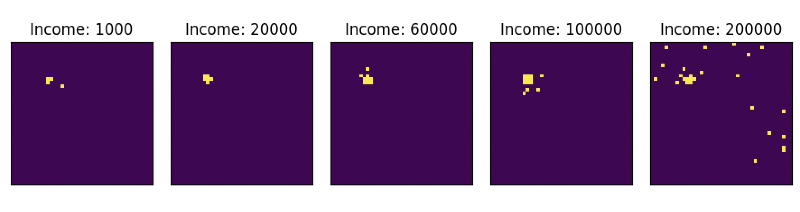

# Model Summary

## Overview & Process
Our household mobility model  simulates the movement of agents, or households, within a finite geographic grid, or environment, composed of heterogeneous locations (e.g., cities, suburbs, towns). The primary components of the simulation are the simulation itself (consisting of the environment and the functions governing its interactions with agents and the data it generates), the agents, and the locations. Agents and locations are characterized by multiple variable and invariant attributes, and simulations by multiple tunable parameters that affect the operation of the methods defined for agents and locations according to specific environmentally-defined conditions. 

Our early efforts at model development created a functional structure consisting of the environment and simplified versions of locations and agents; we approximated real-world initialization distributions and piloted mechanisms based on straightforward linear combinations of variables representing move probabilities and location selection processes. As our model demonstrated a baseline capacity to function as intended and to generate interesting behavior, we began to integrate nonlinear, interdependent equations in an effort to represent more complex dynamics among model components and to embed within the structure richer assumptions about the conditions governing agents' decision-making processes.  

## Modeling Assumptions
We embed certain assumptions into our model, specifically: (1) The location being modeled has periodic boundaries,  (2) The total number of locations and agents remains constant, representing a closed system, (3) Certain attributes for each component are fixed for the duration of the simulation: for example, a location’s quality score and population capacity, (4) job opportunity can be approximated through a location’s population (i.e., more populated areas will have greater job opportunity, and (5) The COVID-19 pandemic presented system-wide changes to certain agent preferences (e.g., population density of home location), attributes (household income), and behaviors (increased radius for job-related moves).

### Structure
We consider a model of $N$ agents that occupy sites, called locations, on regular grid of size $g \times g$. We refer to the set of all agents as $A = \{ A_i \}$ and all locations as $L = \{L_{xy}\}$. Agents move from location to location according to stochastic processes defined below.

## Initial State

### Locations

To begin our simulation, we initialize each location $L_{xy}$ with a capacity, $s_{xy}$, which represents the maximum number of agents who can occupy location $(x,y)$. These capacities remain invariant throughout the simulation. To establish the landscape, we place $2g$ "cities" $\{V_i\}$ on the grid, where each city $V_i$ decays as a multivariate normal centered about a randomly chosen location $x,y$ and covariance matrix $\text{diag}(w_i,w_i)$. The size of the city $k_i$ is drawn from an inverse powerlaw distribution with exponent $2.5$, and its width is $w_i = \log(k_i)/2$. The total capacity at each location $(x,y)$ is given by
$$s_{xy} \propto \sum_{i=1}^{2g} k_i V_i(x,y).$$
The capacities $\{ s_{xy} \}$ are normalized such that
$$s_{total} = \sum_{xy} s_{xy} = \phi_{\text{global}} N,$$
where $\phi_{\text{global}}$ is the global occupancy of the system. Figure \ref{location_capacities} shows an example of the initial state. 

% [INSERT INITIALIZEDINCOMEDISTRIBUTION.PNG]
\begin{figure}[H]
    \centering
    \includegraphics[width=8cm]{figures/capacities.png}
    \caption{Sample of initialized capacity distribution for locations.}
    \label{location_capacities}
\end{figure}

Each location $j = (x,y)$ has the following properties:
- A median income $I^{*}_j$ at any point, represents the median income of all agents currently living at location $j$.
- The occupancy of the location $\phi_j \in [0,1]$ represents the ratio of the number of agents living at location $j$ to the locations capacity $s_j$.
- The cost of housing $h$ is given by
    $$h_j = 0.3 I^{*}_j + \gamma \frac{\phi}{1-\phi}$$. 

The above function for housing cost assumes that prices depend on what occupants are willing to pay, and we assume that median income is an important factor in determining that maximum price. We set housing cost as  30\% of the median income of a location's population, a rate that is defined by the United States Department of Housing and Urban Development to be 'affordable' \cite{hud2006hud}. The housing cost function also depends on occupancy, or the ratio of a location’s point-in-time population to its initialized capacity, which we consider to be a proxy for demand. Hence, as $\phi \to 1$, we expect housing cost to increase steeply, and for the purposes of our model, $h_j \to \infty$ in this limit.

For the purposes of the simulation, all prices are relative, and so while the exact value of housing cost is not paramount, the parameter $\gamma$ does play an important role in determining the relative importance of fluctuating demand versus demographic makeup of a location. We choose $\gamma = 1500$.

### Agents

We initialize each agent $A_i$ with the following properties:
- The agent's income $I_i$ is drawn from an inverse power law $p(I) = a I^{-a}$. The agent's income remains fixed throughout the simulation.
- Preferred population size $s'_i$, is drawn randomly from a distribution $p(s') = \text{LogNormal}(\bar{s},0.5)$
- A remote work status $q$, is equal to $1$ if working remotely and $0$ otherwise.
As each agent's income and preferred population size are drawn independently, we assume no correlation of these variables.

## Model Dynamics

At each time step $t$, agent $i$ is updated according to the following process:
1. With probability $P(L,A)$, agent $i$ decides to move. If the agent does not move, their update is complete.
2. If moving, the agent selects $n$ search locations using a locally-biased random search of their surroundings.
3. The agent chooses the optimal move location according to a cost function $C$ which encodes their preferences.
4. The agent then moves to the optimal location.

## Deciding whether to move
We calculate the probability of moving with a second cost function, which is given by
$$D_i = \alpha \frac{h_{L_i}}{I_i}.$$
We then calculate the probability using a sigmoid function
$$p(D_i) = \frac{1}{1+e^{-(m D_i - b)}},$$

where $m=1.25$ and $b=6$. These values were tuned according to the model output such that the overall move rate is reasonably low so that moves to simultaneous locations are unlikely and updates can be done asynchronously.

## Choosing a new location

Once agents decide to move, they select $n$ locations to search, where $n$ is a function that depends on income:
$$n(I) = \text{int}(3 + m_n I),$$

and $m=0.00011$ is a coefficient ensuring that an income of $\$200,000$ has $25$ location choices. This choice captures an assumption that higher income people are more capable of exerting time and resources on finding an optimal place to live.

The locations are selected by choosing an angle $\theta ~ \text{Uniform}(0,2\pi)$ and a distance $d ~ \text{Power}(\xi)$, where $xi$ also depends on income as
$$\xi(I) = 1.2 + m_{\xi} I$$
and $m_{\xi} = 0.000019$ is set such that the $\xi(200,000) = 4$. Together, $d$ and $\theta$ define a location relative to the agent. These values are discretized and the closest grid space is found. The dependency of $\xi$ on income also captures an assumption that higher income people have the resources to move farther than lower-income individuals. Figure \ref{move_choice} shows examples of how move choices might look for various agent incomes.

\begin{figure*}
    \centering
    \includegraphics[width=0.9\textwidth]{figures/move_possibilities_by_income.png}
    \caption{Examples of move choices broken down by agent income.}
    \label{move_choice}
\end{figure*}

From the $n(I_i)$ search locations, each agent chooses the location that maximizes the cost function $C_i(L_j)$. This function summarizes all the preferences of an agent, and depends on the following factors:
- The fit between the agent's preferred population density and that of the location in question
- A global preference for higher location capacities, which we describe below as a proxy for the greater job opportunity in higher-density areas, such as cities. Moreover, this effect should not occur for remote workers, who can work from anywhere.
- A preference for living in a location where the median income is as close to the agent's income. We can interpret this as a homophily parameter that indirectly encourages clustering of agents of similar income to live together. We interpret this mechanism as capturing the desire of agents to live within their means, not below or above.
- A preference for lower housing cost. This term is down-weighted by income, such that higher-income agents are less influenced by this effect.

These factors are quantified mathematically as 
$$
    C_i(L_j) = \beta_0 \left|s' - s_j\right| + \beta_1 (1-q) s_j + \beta_2 |I^{*}_j - I_i| - \beta_3 \frac{h}{I_i}
$$

The values of $\beta_i$ are chosen in a somewhat ad hoc fashion such that the typical values of each term of the cost function are roughly equivalent. However, deviation from these baseline values increases the relative impact of the term. For example, increasing $\beta_1$ would increase agent's preference to live in a city.

Importantly, an agent's current location is always included in the list of search locations, so at each time step, agent's might want to move, but choose not to because their search did not reveal a more optimal living location.

We chose these mechanisms as a minimal description of the model mechanisms we wished to consider. In particular, we are interested in the tension between desire to live with proximity to a city but also with a lower population density. This tension between the job opportunity of cities and affordable or lower-density living accommodation is explicitly a trade-off that agents negotiate.

## Introducing COVID-19
We introduce COVID-19 as an exogenous shock to the housing system, whereby agents' preferences change suddenly and all at once. At time $t^*$, we set all agents with income greater than a threshold $I_{rt}$ as remote. This alleviates the aforementioned tension between living in cities for job opportunity and a desire to live in lower-population areas.

Because we were particularly curious about the influx of city dwellers to suburban and rural areas due to the rise of remote work, we did not make any other adjustments to the model, though many possibilities might make sense. For instance, one could justify adjusting making an instantaneous adjustment of every agent's preferred population density to more rural areas, since the appeal of living in cities waned with the closing of restaurants, museums, and all the other attractions of a city.